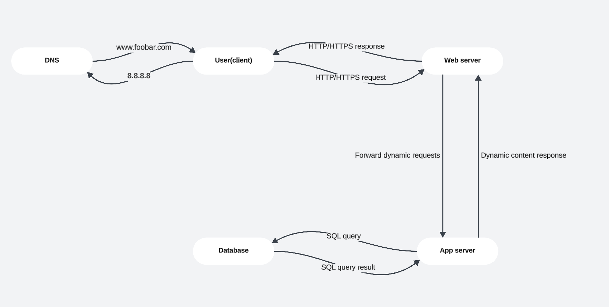

# Simple Web Infrastructure Design

## 1. User Request Flow
1. **User Access**:
   - Types `www.foobar.com` in browser
   - Initiates HTTP/HTTPS request

2. **DNS Resolution**:
   - `www.foobar.com` → A Record → IP `8.8.8.8`
   - Server: Physical/Virtual machine in data center running Linux OS

## 2. Server Components
1. **Web Server (Nginx)**:
   - Handles HTTP/HTTPS (TCP/IP)
   - Serves static files (HTML/CSS/JS)
   - Proxies dynamic requests to application server

2. **Application Server**:
   - Executes Python/PHP/Node.js code
   - Processes business logic
   - Connects to database via SQL

3. **Database (MySQL)**:
   - Stores all application data
   - Handles data persistence and queries

4. **Application Files**:
   - Contains complete codebase
   - Hosted on same server

## 3. Communication Protocol
- **External**: HTTP/HTTPS over TCP/IP (Ports 80/443)
- **Internal**:
  - Web Server ↔ App Server (FastCGI/WSGI)
  - App Server ↔ Database (MySQL on port 3306)

## 4. Infrastructure Limitations
1. **Single Point of Failure**:
   - No backup → Complete service outage if server fails

2. **Maintenance Downtime**:
   - Requires full restart for deployments
   - Example: 5-10 minutes downtime per deployment

3. **Scaling Limitations**:
   - Maximum ~10,000 concurrent users
   - No horizontal scaling possible

4. **Security Risks**:
   - Compromise of one component risks entire system

## 5. Diagram

