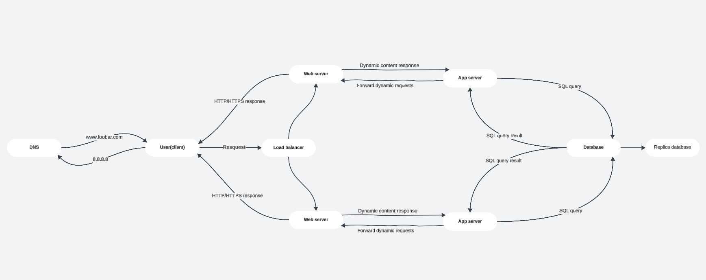

# Three-Server Web Infrastructure Design

## 1. User Initiates the Request
I’m a user, and I want to access the website by typing `www.foobar.com` in my browser.

## 2. DNS Resolution
My browser sends a DNS request to translate `www.foobar.com` into an IP address. The DNS server responds with the IP address `8.8.8.8`, which points to the **load balancer**.

## 3. Load Balancer (HAProxy)
The request first reaches the **load balancer (HAProxy)**. The load balancer:
- Distributes incoming traffic across the available web servers to ensure no single server becomes overloaded.
- Uses a **Round Robin** algorithm (or another algorithm like Least Connections) to decide which server handles the request.
- Supports an **Active-Active setup**, meaning all web servers are actively handling requests to maximize availability and resource utilization.

### Active-Active vs. Active-Passive
- **Active-Active**: All servers are actively serving requests. If one fails, traffic is redirected to the remaining servers.
- **Active-Passive**: Only one server is active, and a secondary server becomes active only if the primary server fails.

## 4. Web Server (Nginx)
The load balancer forwards the request to one of the **web servers** running Nginx. 
- If the request is for **static content** (e.g., images, CSS, JavaScript), Nginx serves it directly.
- If the request is for **dynamic content**, Nginx forwards it to the application server.

## 5. Application Server
The application server runs the logic of the website using the code base hosted on the server. It processes user input, interacts with the database, and generates dynamic responses.

## 6. Database and Rendering Process

The **MySQL database cluster** uses a **Primary-Replica setup**:
- The **Primary node** handles all write operations, while the **Replica node** processes read operations to distribute the workload and improve performance.
- Data changes are replicated from the Primary to the Replica in real-time, ensuring consistency. In case of Primary node failure, the Replica can be promoted to Primary (manual or automatic failover).

After processing user requests, the **application server** communicates with the database, generates the necessary data, and sends it to the **web server**. The web server forwards the response to the **load balancer**, which delivers it to the user’s browser for rendering.

---

# Issues with this Infrastructure

## Single Points of Failure (SPOF)
- The load balancer itself is a SPOF. If it fails, the entire system becomes inaccessible.
- The Primary database node is a SPOF for write operations.

## Security Issues
- No firewall to filter traffic and protect against malicious requests.
- No HTTPS to encrypt data transmitted between the user and the servers.

## No Monitoring
- There is no system in place to track server performance or detect failures in real-time.

---

