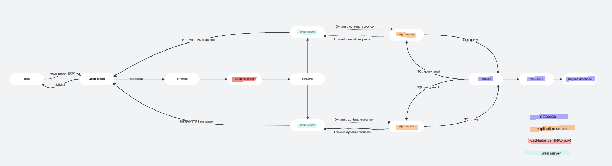

# Scalable Web Infrastructure

## 1. User Accesses the Website
As a user, I type **www.foobar.com** into my browser. The browser performs a DNS query to resolve **www.foobar.com** into the corresponding IP address. The DNS server responds with the IP address of the load balancer.

---

## 2. Request Reaches the Load Balancer (HAProxy Cluster)
The browser sends an **HTTPS request** to the load balancer. In this infrastructure, we have **HAProxy configured in a cluster** to distribute incoming traffic effectively:
- The load balancer ensures high availability by routing requests to the available backend servers.
- HAProxy is configured in a **cluster mode**, meaning there are two or more instances of HAProxy, each handling traffic and providing failover in case one instance fails.

---

## 3. Load Balancer Distributes Traffic to Web Servers
The load balancer then forwards the request to one of the **web servers** in the pool. 
- The load balancer uses an algorithm (like **round-robin**) to evenly distribute the incoming requests across the web servers.
- The web servers are responsible for serving static content (e.g., HTML, CSS, images) and acting as a gateway to the application servers.

---

## 4. Web Server Forwards Requests to Application Servers
If the request requires dynamic content (e.g., personalized user data), the web server forwards the request to the **application server**. The application server contains the business logic and the codebase for generating dynamic content. The application server handles requests like:
- Retrieving user data from the database
- Performing operations on the data and generating content

---

## 5. Application Server Interacts with the Database
The **application server** interacts with the **database** for storing and retrieving data. In this case, the database is separated onto its own dedicated server for better performance and scalability. The database handles:
- Write operations (insert, update, delete) on the **Primary MySQL database**.
- Read operations from the **Replica MySQL database** for improved performance and redundancy.

---

## 6. Response is Sent Back to the User
Once the application server processes the request, it sends the data back to the web server, which then forwards the response to the load balancer. Finally, the load balancer returns the response to the user's browser. The browser renders the webpage, and the user can interact with the website.

---

## Why Add These Components?
1. **HAProxy Cluster**:
   - Adds **high availability** and **scalability** by load balancing requests across multiple servers.
   - The cluster setup ensures that if one load balancer fails, the other can take over, minimizing downtime.

2. **Web Server**:
   - Handles **static content** and **manages traffic** to application servers.
   - Offloads the application servers by handling static requests directly, improving performance.

3. **Application Server**:
   - Centralizes business logic and dynamic content generation, ensuring a clean separation of concerns in the architecture.
   - Allows for better resource allocation and scaling of business logic.

4. **Database Server**:
   - Offloads database operations onto a separate server, improving both **performance** and **scalability**.
   - Reduces load on the application server, enabling better handling of high traffic.

---

## Key Issues and Considerations
1. **Single Point of Failure (SPOF)**:
   - While HAProxy ensures high availability, if any of the servers (web, application, or database) fail, the system may experience downtime. Consider adding redundancy (e.g., multiple database replicas).

2. **Scaling**:
   - While HAProxy can handle increased traffic by distributing load, it is important to monitor and scale servers (web, application, and database) as needed to maintain performance under heavy load.

3. **Security**:
   - Ensure that communication between components (web server to application server, etc.) is encrypted using HTTPS to prevent security vulnerabilities.

---

## Additional Required Components (to meet all task requirements)

- An **additional server** was added to improve scalability and allow distribution of components across dedicated machines.

- An **additional HAProxy load balancer** is configured in cluster mode to avoid a single point of failure and ensure high availability.

- The infrastructure is now fully **split by components**, with:
  - One or more **dedicated web servers** handling only static content.
  - One or more **dedicated application servers** responsible only for business logic and dynamic requests.
  - A **dedicated database server** (with optional replica) managing all persistent storage operations.

